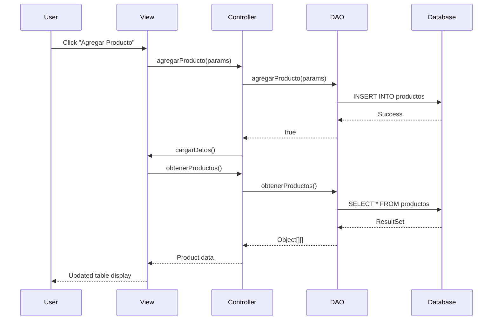

## Overview

The Veterinaria ALFA Inventory System follows a classic **Model-View-Controller (MVC)** architecture pattern, providing clear separation of concerns between data management, business logic, and user interface components.

## Architecture Pattern

### MVC Structure

The application is organized into three main packages that correspond to the MVC layers:

```
src/main/java/
├── model/          # Data access and business logic
├── view/           # User interface components
├── controller/     # Application logic coordination
└── InventarioApp   # Application entry point
```

<Accordion title="Model Layer (model/)">
  **Purpose**: Handles data persistence and database operations
  
  **Key Classes**:
  - `InventarioDAO.java` - Data Access Object for all database operations
  
  **Responsibilities**:
  - Database connection management
  - CRUD operations for products
  - Sales transaction management
  - Product reservation (apartados) handling
  - CSV export functionality
  - Expiration date validation and alerts
</Accordion>

<Accordion title="View Layer (view/)">
  **Purpose**: Provides the graphical user interface using Java Swing
  
  **Key Classes**:
  - `InventarioView.java` - Main inventory management interface
  - `AgregarMedicamentoView.java` - Add new product dialog
  - `EditarMedicamentoView.java` - Edit existing product dialog
  - `VentasView.java` - Sales history interface
  - `RegistrarVentaView.java` - Register new sale dialog
  - `EditarVentaView.java` - Edit sale record dialog
  - `ApartadosView.java` - Reserved products interface
  - `RegistrarApartadoView.java` - Register product reservation dialog
  - `EditarApartadoView.java` - Edit reservation dialog
  
  **Responsibilities**:
  - User input collection and validation
  - Data display in tables and forms
  - Event handling (button clicks, table selections)
  - Visual feedback (hover effects, color coding)
  - Dialog management
</Accordion>

<Accordion title="Controller Layer (controller/)">
  **Purpose**: Coordinates communication between Model and View
  
  **Key Classes**:
  - `InventarioController.java` - Main controller for inventory operations
  
  **Responsibilities**:
  - Delegates user actions to the Model
  - Triggers View updates after data changes
  - Business logic coordination
  - Data transformation between layers
</Accordion>

## Data Flow

### Typical User Action Flow

1. **User Interaction** → User clicks a button or enters data in the View
2. **Event Handling** → View captures the event and calls Controller method
3. **Business Logic** → Controller validates and processes the request
4. **Data Access** → Controller delegates to DAO for database operations
5. **View Update** → Controller triggers View refresh to display updated data



## Component Relationships

### Application Entry Point

**File**: `InventarioApp.java` (root package)

The main entry point initializes the application:

```java
public class InventarioApp {
    public static void main(String[] args) {
        SwingUtilities.invokeLater(() -> {
            InventarioDAO dao = new InventarioDAO();
            dao.crearBaseDeDatos(); // Initialize database
            InventarioController controller = new InventarioController(dao);
            new InventarioView(controller); // Launch main window
        });
    }
}
```

### Dependency Structure

- **InventarioApp** creates **InventarioDAO** and **InventarioController**
- **InventarioController** depends on **InventarioDAO**
- **View** classes depend on **InventarioController**
- **Controller** maintains reference to **InventarioView** for callbacks

## UI Component Architecture

### Main Window (InventarioView)

The main inventory window provides:
- Product table with sorting and filtering
- Search functionality
- CRUD operations (Add, Edit, Delete)
- Navigation to Sales and Reservations modules
- CSV export capability
- Expiration date alerts with color coding

### Dialog Windows

All dialog windows extend `JDialog` and follow a consistent pattern:
- Modal dialogs that block parent window
- GridBagLayout for form inputs
- Styled buttons with hover effects
- Input validation before submission
- Automatic parent view refresh on success

### Visual Features

<Note>
  The application includes several UX enhancements:
  - **Hover effects** on table rows and buttons
  - **Color coding** for expiration dates (red for expired, light red for near expiration)
  - **Multi-select** support in tables
  - **Real-time filtering** with regex support
  - **Sortable columns** in all table views
</Note>

## Database Connection

### Connection Management

The DAO manages a single `Connection` object:
- SQLite JDBC driver: `org.xerial:sqlite-jdbc:3.41.2.1`
- Database location: `./db/baseDeDatosInventario.db`
- Connection is established in constructor and reused
- `ensureConnection()` method checks and recreates closed connections

### Database URL

```java
String carpetaBD = "./db";
File folderFile = new File(carpetaBD);
if (!folderFile.exists()) {
    folderFile.mkdirs();
}
this.dbUrl = "jdbc:sqlite:" + carpetaBD + "/baseDeDatosInventario.db";
```

<Note>
  The database file is created in a `db/` subdirectory relative to the application executable, making it portable and easy to locate.
</Note>

## Key Design Patterns

### Data Access Object (DAO)

The `InventarioDAO` class encapsulates all database operations, providing a clean interface for the Controller layer.

### Observer Pattern

The Controller maintains a reference to `InventarioView` and calls `cargarDatos()` or `actualizarTabla()` whenever data changes, implementing a simple observer pattern.

### Model-View-Controller (MVC)

Clear separation between:
- **Model** (data and persistence)
- **View** (presentation and user interaction)
- **Controller** (coordination and business logic)

## Technology Stack

| Component | Technology |
|-----------|-----------|
| **Language** | Java 21 |
| **UI Framework** | Java Swing |
| **Database** | SQLite 3 |
| **Build Tool** | Maven 3.13.0 |
| **Date Picker** | JCalendar 1.4 |
| **JDBC Driver** | SQLite JDBC 3.41.2.1 |
| **Testing** | JUnit Jupiter 5.10.0 |

## Build Configuration

The application can be packaged as:
1. **Standard JAR** with `maven-jar-plugin`
2. **Fat JAR** (with dependencies) using `maven-shade-plugin`

Main class: `InventarioApp`

See [Configuration](/reference/configuration) for Maven setup details.
