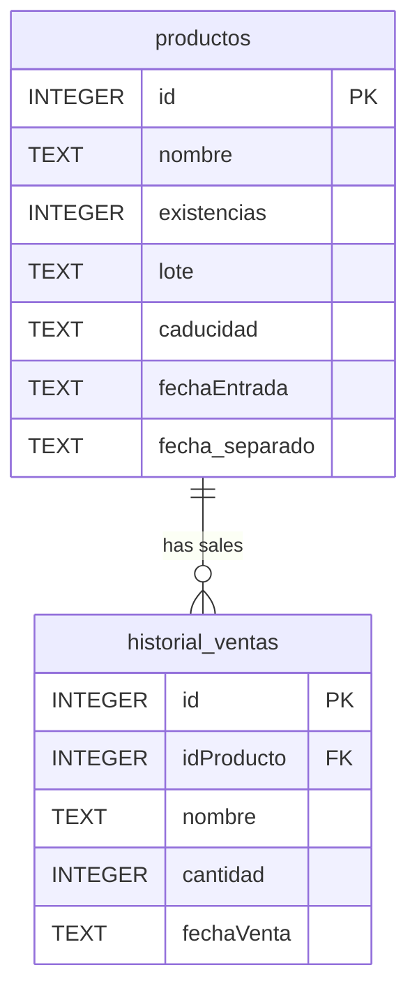

## Overview

The Veterinaria ALFA Inventory System uses **SQLite** as its embedded database. The schema consists of two main tables that manage product inventory and sales history.

<Note>
  The database is automatically created at `./db/baseDeDatosInventario.db` on first application launch via the `crearBaseDeDatos()` method in `InventarioDAO.java`.
</Note>

## Tables

### productos

Stores information about all pharmaceutical products in the veterinary inventory.

<ResponseField name="id" type="INTEGER" required>
  Primary key, auto-incremented unique identifier for each product.
</ResponseField>

<ResponseField name="nombre" type="TEXT" required>
  Name of the pharmaceutical product or medication.
</ResponseField>

<ResponseField name="existencias" type="INTEGER" required>
  Current stock quantity available in inventory. Must be non-negative.
</ResponseField>

<ResponseField name="lote" type="TEXT" required>
  Batch or lot number for product traceability.
</ResponseField>

<ResponseField name="caducidad" type="TEXT" required>
  Expiration date in `yyyy-MM` format (e.g., "2025-07"). Used for expiration alerts and visual warnings.
</ResponseField>

<ResponseField name="fechaEntrada" type="TEXT" required>
  Date the product was added to inventory in ISO format `yyyy-MM-dd` (e.g., "2024-03-15").
</ResponseField>

<ResponseField name="fecha_separado" type="TEXT">
  Date the product was reserved (apartado) in ISO format `yyyy-MM-dd`. NULL if product is not reserved.
</ResponseField>

#### SQL Definition

```sql
CREATE TABLE IF NOT EXISTS productos (
    id INTEGER PRIMARY KEY AUTOINCREMENT,
    nombre TEXT,
    existencias INTEGER,
    lote TEXT,
    caducidad TEXT,
    fechaEntrada TEXT,
    fecha_separado TEXT
)
```

#### Table Indexes

- **Primary Key**: Automatically indexed on `id` column
- No additional indexes defined

#### Constraints

- `id`: Auto-incrementing primary key
- `existencias`: Application-level validation ensures non-negative values
- `caducidad`: Application-level validation ensures `yyyy-MM` format
- `fecha_separado`: Can be NULL for non-reserved products

### historial_ventas

Records all sales transactions, tracking which products were sold, quantities, and dates.

<ResponseField name="id" type="INTEGER" required>
  Primary key, auto-incremented unique identifier for each sale record.
</ResponseField>

<ResponseField name="idProducto" type="INTEGER" required>
  Foreign key referencing `productos.id`. Links the sale to the specific product.
</ResponseField>

<ResponseField name="nombre" type="TEXT" required>
  Product name at time of sale (denormalized for historical record keeping).
</ResponseField>

<ResponseField name="cantidad" type="INTEGER" required>
  Quantity of product sold in this transaction. Must be positive.
</ResponseField>

<ResponseField name="fechaVenta" type="TEXT" required>
  Date of the sale in ISO format `yyyy-MM-dd` (e.g., "2024-03-15").
</ResponseField>

#### SQL Definition

```sql
CREATE TABLE IF NOT EXISTS historial_ventas (
    id INTEGER PRIMARY KEY AUTOINCREMENT,
    idProducto INTEGER,
    nombre TEXT,
    cantidad INTEGER,
    fechaVenta TEXT,
    FOREIGN KEY (idProducto) REFERENCES productos(id) ON DELETE CASCADE
)
```

#### Foreign Keys

<Accordion title="idProducto → productos(id)">
  **Relationship**: Many-to-One
  
  **On Delete**: CASCADE - When a product is deleted from `productos`, all associated sales records are automatically deleted
  
  **Note**: This maintains referential integrity but means historical sales data is lost if a product is deleted. Consider soft deletes for production use.
</Accordion>

#### Table Indexes

- **Primary Key**: Automatically indexed on `id` column
- **Foreign Key**: Automatically indexed on `idProducto` column (SQLite behavior)

## Data Types

### Date Storage

All dates are stored as **TEXT** in ISO-8601 format:

| Field | Format | Example | Usage |
|-------|--------|---------|-------|
| `fechaEntrada` | `yyyy-MM-dd` | `2024-03-15` | Product entry date |
| `fechaVenta` | `yyyy-MM-dd` | `2024-03-15` | Sale transaction date |
| `fecha_separado` | `yyyy-MM-dd` | `2024-03-15` | Reservation date |
| `caducidad` | `yyyy-MM` | `2025-07` | Expiration year-month |

<Note>
  SQLite does not have a native date/time type. Dates are stored as TEXT and parsed using Java's `LocalDate` and `YearMonth` classes.
</Note>

### Numeric Types

- **INTEGER**: Used for IDs, quantities, and stock levels
- **TEXT**: Used for all string data and dates

## Relationships



## Common Queries

### Get All Products

```sql
SELECT * FROM productos
```

**Location**: `InventarioDAO.obtenerProductos()` (line 94)

### Get Products Near Expiration

```sql
SELECT * FROM productos
```

Filtered in Java code to check expiration dates within threshold.

**Location**: `InventarioDAO.obtenerMedicamentosProximosACaducar(int diasUmbral)` (line 486)

### Get Expired Products

```sql
SELECT * FROM productos
```

Filtered in Java code to find products past expiration date.

**Location**: `InventarioDAO.obtenerMedicamentosCaducados()` (line 521)

### Get Reserved Products

```sql
SELECT * FROM productos 
WHERE fecha_separado IS NOT NULL AND fecha_separado <> ''
```

**Location**: `InventarioDAO.obtenerProductosApartados()` (line 571)

### Get Sales History

```sql
SELECT id, idProducto, nombre, cantidad, fechaVenta 
FROM historial_ventas 
ORDER BY id ASC
```

**Location**: `InventarioDAO.obtenerHistorialVentas()` (line 426)

### Add Product

```sql
INSERT INTO productos (nombre, existencias, lote, caducidad, fechaEntrada) 
VALUES (?, ?, ?, ?, ?)
```

**Location**: `InventarioDAO.agregarProducto()` (line 119)

### Register Sale

```sql
-- Step 1: Verify product exists and has sufficient stock
SELECT nombre, existencias FROM productos WHERE id = ?

-- Step 2: Decrease inventory (within transaction)
UPDATE productos SET existencias = existencias - ? WHERE id = ?

-- Step 3: Record sale (within transaction)
INSERT INTO historial_ventas (idProducto, nombre, cantidad, fechaVenta) 
VALUES (?, ?, ?, ?)
```

**Location**: `InventarioDAO.registrarVenta()` (line 247)

<Note>
  Sales are processed within a transaction to ensure atomicity. If any step fails, all changes are rolled back.
</Note>

## Database Initialization

The database and tables are created automatically on first run:

```java
public void crearBaseDeDatos() {
    try (Statement stmt = connection.createStatement()) {
        // Create productos table
        stmt.execute("CREATE TABLE IF NOT EXISTS productos (...)");
        
        // Create historial_ventas table with foreign key
        stmt.execute("CREATE TABLE IF NOT EXISTS historial_ventas (...)");
    } catch (SQLException e) {
        e.printStackTrace();
    }
}
```

**Location**: `InventarioDAO.crearBaseDeDatos()` (line 69)

## Data Validation

### Application-Level Validation

The application enforces these business rules before database operations:

<ParamField path="existencias" type="integer" required>
  Must be non-negative (≥ 0). Validated before insert/update operations.
</ParamField>

<ParamField path="caducidad" type="string" required>
  Must match format `yyyy-MM` and be a valid year-month. Validated using regex and `YearMonth.parse()`.
</ParamField>

<ParamField path="nombre" type="string" required>
  Cannot be empty or whitespace-only. Trimmed before validation.
</ParamField>

<ParamField path="cantidad" type="integer" required>
  Must be positive (> 0) for sales. Must not exceed available stock.
</ParamField>

### Stock Validation

Before registering a sale, the system verifies:
1. Product exists by ID
2. Product name matches (for additional verification)
3. Sufficient stock is available (`cantidad <= existencias`)

## Database Location

<Accordion title="Default Location">
  The database is created in a `db/` subdirectory relative to the application:
  
  ```
  ./db/baseDeDatosInventario.db
  ```
  
  If running from JAR: `./db/` is relative to JAR location
  
  If running from IDE: `./db/` is relative to project root
</Accordion>

<Accordion title="Custom Location">
  To use a custom database location, provide a JDBC URL to the `InventarioDAO` constructor:
  
  ```java
  String customUrl = "jdbc:sqlite:/path/to/custom/database.db";
  InventarioDAO dao = new InventarioDAO(customUrl);
  ```
</Accordion>

## Backup and Export

### CSV Export

The application provides CSV export functionality for:

1. **Complete Inventory** (`exportarInventarioCSV`)
2. **Sales History** (`exportarCSV`)
3. **Reserved Products** (`exportarApartadosCSV`)

Exports include all relevant fields in comma-separated format with headers.

### Database Backup

<Note>
  To backup the database, simply copy the `./db/baseDeDatosInventario.db` file while the application is closed.
</Note>
